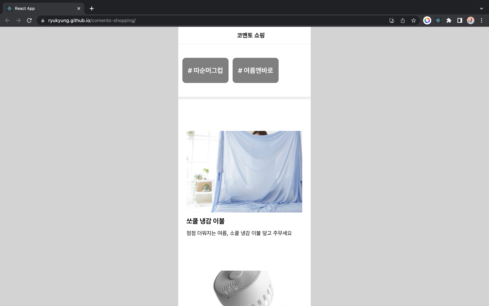
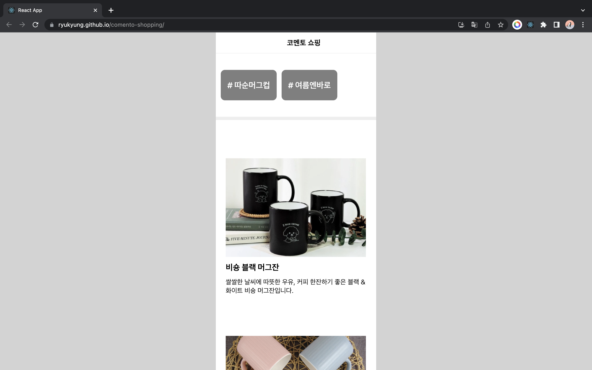
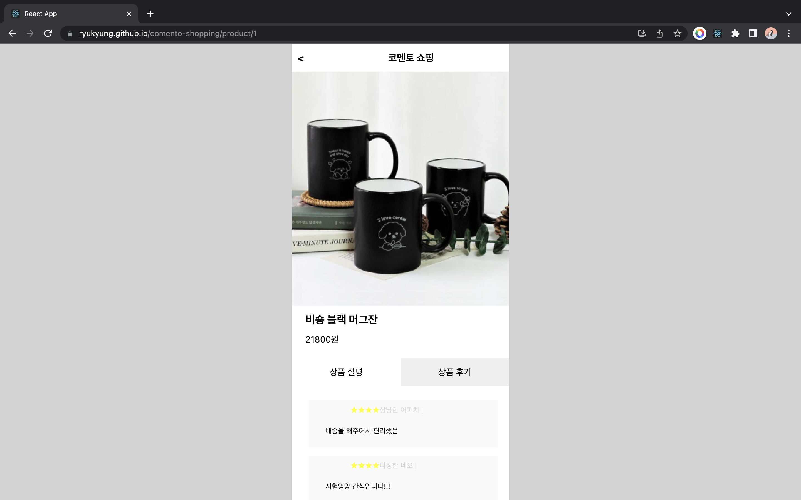

### comento-shopping

[comento-shopping](https://ryukyung.github.io/comento-shopping/)

### 📝 Description

'스타트업 프론트엔드 개발자로 실무 체험하기' 주제로 5주 동안 멘토링을 들으며 만들었던 페이지입니다. 기획서와 디자인을 확인해 API 명세서 초안을 만들고 가짜 서버와 API를 만들어 데이터를 불러온다. 디자인 시안을 확인하여 UI를 개발합니다.

### 🔍 Preview

### **🧰 Tools**

    
  
  

